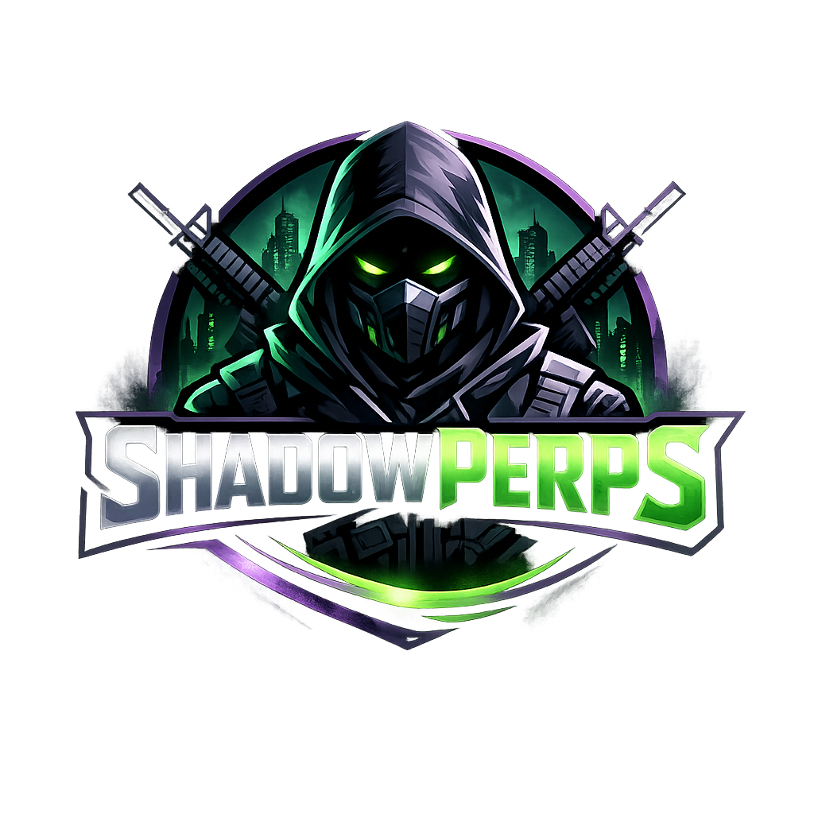

<p align="center">
  
</p>

<h1 align="center">ShadowPerps</h1>

<p align="center">
  <strong>Confidential Perpetual Trading on Arbitrum Sepolia</strong><br/>
  <em>Hidden positions. Encrypted leverage. MEV-resistant execution.</em>
</p>

<p align="center">
  
  
  
  
  
  
  
  
  
  
</p>

---

## What Is Live Today

### Perps (FHE Encrypted)

- `requestOpenPosition` -> `finalizeOpenPosition` is live
- `requestClosePosition` -> `finalizeClosePosition` is live
- Position **direction** and **size** are submitted as encrypted CoFHE inputs
- Portfolio reads ciphertext handles from `ShadowPerps`, then decrypts locally in the wallet
- Trade and portfolio use the on-chain oracle as the shared source of truth for entry and mark prices

### Market Data

- Chart, candles, and market list come from the Rust engine
- The engine fetches live prices from CryptoCompare
- The engine also syncs those prices to the on-chain mock oracle on an interval

### Liquidity Pool

- `/pool` is backed by `ShadowPool` (public LP v1)
- LP deposit, withdraw, balances, and pool stats are live on-chain
- Privacy-ready LP contracts (`ConfidentialAssetVault` + `ShadowPoolV2`) are deployed but not yet wired into the live app

---

## Privacy Scope

| Data | Private? | Method |
|---|---|---|
| Position direction | **Yes** | `ebool` CoFHE ciphertext |
| Position size | **Yes** | `euint128` CoFHE ciphertext |
| Close payout | **Yes** | Ciphertext until wallet-side decrypt |
| Liquidation check | **Yes** | Ciphertext until wallet-side decrypt |
| Wallet address | No | On-chain |
| USDC collateral | No | Public ERC-20 transfer |
| Market symbol | No | Public |
| LP deposits/withdrawals | No | Public (v1) |

---

## Architecture

```text
Frontend (Next.js 16, React 19)
  wagmi + viem + @cofhe/sdk
  local wallet-side decrypt
  /api/cofhe/* proxy routes
         |
         | encrypted request/finalize flow
         v
Smart Contracts (Solidity 0.8.25)
  ShadowPerps.sol          live confidential perps
  MockPriceOracle.sol      live on-chain oracle
  ShadowPool.sol           live public LP pool
  ShadowPoolV2.sol         privacy-ready LP scaffold
  ConfidentialAssetVault   privacy-ready vault scaffold
         ^
         | price sync txs
         |
Engine (Rust / Axum / Tokio)
  live market prices (CryptoCompare)
  OHLCV candles endpoint
  periodic on-chain oracle sync
```

---

## Deployments (Arbitrum Sepolia)

### Live

| Contract | Address |
|---|---|
| **ShadowPerps** | `0xeBdCcDaC7B0b28A2bfF1EEb5Ab16B288487f67D6` |
| **MockPriceOracle** | `0x9cf7B692CfD764009388884f7bF256523739365C` |
| **ShadowPool** | `0x6ed20c5B4DBA82D213aeDFc8010eAE3cE5203798` |
| **USDC (Circle)** | `0x75faf114eafb1BDbe2F0316DF893fd58CE46AA4d` |

### Privacy-Ready LP (deployed, not yet wired)

| Contract | Address |
|---|---|
| **ConfidentialAssetVault** | `0xf7fb1473A321E30C44Cc445069De4464e00CAb9E` |
| **ShadowPoolV2** | `0xdf86Ba46B021973885CCD78B67032F067EF3a53B` |

---

## Main Flows

### Open Position

1. User enters market, collateral, direction, and leverage in the UI
2. Frontend encrypts direction + size via CoFHE SDK
3. Frontend calls `requestOpenPosition(...)`
4. Wallet decrypts the validation boolean
5. Frontend calls `finalizeOpenPosition(...)` with decrypt proof
6. Contract transfers USDC collateral, charges fee, stores encrypted position on-chain

### Close Position

1. Frontend calls `requestClosePosition(...)`
2. Contract computes encrypted payout ciphertext
3. Wallet decrypts payout through CoFHE
4. Frontend calls `finalizeClosePosition(...)` with the decrypt proof
5. Contract settles USDC via the LP pool

### Portfolio

1. Frontend reads `getTraderPositionIds`, `getPositionMeta`, `getPositionCiphertexts`
2. Wallet decrypts `direction` and `size` locally
3. UI computes PnL, leverage, margin ratio, liquidation price client-side

---

## Repository Layout

```text
shadowperps-ui/
├── src/
│   ├── app/
│   │   ├── page.tsx              Landing
│   │   ├── trade/page.tsx        Trading terminal
│   │   ├── portfolio/page.tsx    Portfolio dashboard
│   │   ├── pool/page.tsx         LP pool
│   │   └── api/cofhe/...         CoFHE proxy routes
│   ├── components/
│   │   ├── trading/              Chart, OrderPanel, PositionSummary
│   │   ├── portfolio/            PositionList, PortfolioStats, RiskModule
│   │   ├── layout/               Navbar, Footer
│   │   └── ui/                   Button, Card, Input, Badge
│   ├── hooks/
│   │   ├── useOnChainTrading.ts  FHE encrypt + on-chain tx
│   │   ├── useOnChainPortfolio.ts Decrypt positions from chain
│   │   ├── useOnChainMarket.ts   Oracle price reads
│   │   └── useEngine.ts          Rust engine API hooks
│   └── lib/
│       ├── fhenix.ts             CoFHE SDK wrapper
│       ├── contracts.ts          ABIs + addresses
│       ├── wagmi.ts              Chain config
│       └── engine-api.ts         Engine REST client
├── contracts/
│   ├── src/
│   │   ├── ShadowPerps.sol
│   │   ├── ShadowPool.sol
│   │   ├── ShadowPoolV2.sol
│   │   ├── ConfidentialAssetVault.sol
│   │   └── MockPriceOracle.sol
│   └── scripts/
├── engine/
│   └── src/
│       ├── main.rs
│       ├── api/                  REST endpoints
│       ├── services/             price_feed, liquidation, oracle_sync
│       └── types/
└── .env.example
```

---

## Tech Stack

| Layer | Stack | Purpose |
|---|---|---|
| Frontend | Next.js 16, React 19, Tailwind CSS 4 | Trading terminal UI |
| Wallet | wagmi, viem | Wallet connection + chain management |
| FHE Client | `@cofhe/sdk`, `@cofhe/react` | Browser-side encrypt/decrypt |
| Smart Contracts | Solidity 0.8.25, `@fhenixprotocol/cofhe-contracts` | On-chain FHE positions |
| Chain | Arbitrum Sepolia (421614) | Testnet deployment |
| Engine | Rust, Axum, Tokio | Live prices, candles, oracle sync |
| Price Feed | CryptoCompare | Real-time OHLCV market data |
| Collateral | USDC (Circle testnet) | Real token deposit/withdraw |
| Charts | TradingView Lightweight Charts v5 | Interactive candlestick charts |

---

## Quick Start

### Prerequisites

- Node.js 20+
- Rust toolchain
- MetaMask (or any injected wallet)
- Arbitrum Sepolia ETH for gas
- Test USDC from [Circle Faucet](https://faucet.circle.com/)

### 1. Install

```bash
npm install
npm --prefix contracts install
cd engine && cargo build && cd ..
```

### 2. Configure

```bash
cp .env.example .env.local
# Set contract addresses and private keys
```

### 3. Start Engine

```bash
cd engine && cargo run
# Listening on http://localhost:3010
```

### 4. Start Frontend

```bash
npm run dev
# Open http://localhost:3000
```

---

## Smart Contract Commands

```bash
# Compile
npm --prefix contracts run compile

# Deploy live perps stack
npm --prefix contracts run deploy:arb-sepolia

# Deploy privacy-ready LP scaffold
npm --prefix contracts run deploy:privacy:arb-sepolia
```

---

## Verification Tips

To verify an order really used FHE:

1. Inspect `requestOpenPosition` calldata on [Arbiscan](https://sepolia.arbiscan.io/)
2. Confirm `directionInput` and `sizeInput` are encrypted tuples, not plaintext
3. Confirm the tx flow includes both **request** and **finalize** steps
4. Confirm portfolio data comes from `getPositionCiphertexts(...)` + local decrypt

---

## Known Limitations

- Collateral is still public (normal ERC-20 USDC transfer)
- LP deposit/withdraw is still public (v1)
- `MockPriceOracle` is project-controlled, not a production oracle
- Engine oracle sync sends real transactions, spending gas while enabled
- Privacy-ready LP contracts deployed but not integrated into live trading

---

## Related Docs

- [SHADOWPOOL_PRIVACY_READY.md](./SHADOWPOOL_PRIVACY_READY.md)
- [SUBMISSION.md](./SUBMISSION.md)

## License

MIT
